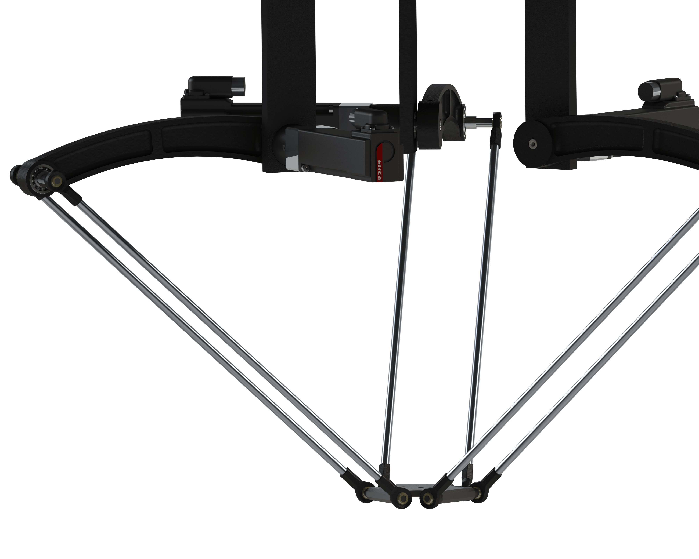
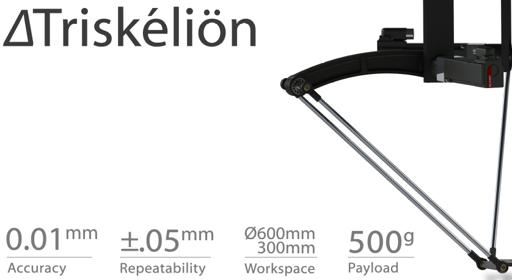

# TRIS-1A Delta Robot
A Delta Robot based on CODESYS & TwinCAT Platform with electrical & mechanical schematics.

## Table of Contents
1. TwinCAT Motion Control project files.
2. CODESYS Motion Control project files.
3. Mechanical schematics developed using Solidworks.
4. Electrical schematics developed using AutoCAD Electrical.

## Early Mockups
1. Conceptual Design
    

2. Concept Poster Design
    

 
## Contact
* email: navalekanishk@gmail.com